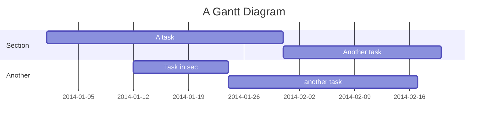

<br/>

<br/>

`from`<swm-token data-swm-token=":manage.py:11:1:1:`        from django.core.management import execute_from_command_line`"/> why?
<!-- NOTE-swimm-snippet: the lines below link your snippet to Swimm -->
### 📄 manage.py
```python
8          """Run administrative tasks."""
9          os.environ.setdefault('DJANGO_SETTINGS_MODULE', 'socialMedia.settings')
10         try:
11             from django.core.management import execute_from_command_line
12         except ImportError as exc:
13             raise ImportError(
14                 "Couldn't import Django. Are you sure it's installed and "
15                 "available on your PYTHONPATH environment variable? Did you "
16                 "forget to activate a virtual environment?"
```

<br/>

Ok

This is a good idea let's use Mermaid to show:

<br/>

<!--MERMAID {width:100}-->

<!--MCONTENT {content: "gantt<br/>\ntitle A Gantt Diagram<br/>\ndateFormat YYYY-MM-DD<br/>\nsection Section<br/>\nA task :a1, 2014-01-01, 30d<br/>\nAnother task :after a1 , 20d<br/>\nsection Another<br/>\nTask in sec :2014-01-12 , 12d<br/>\nanother task : 24d<br/>"} --->

<br/>

<br/>

<br/>

This file was generated by Swimm. [Click here to view it in the app](https://swimm-web-app.web.app/repos/Z2l0aHViJTNBJTNBTG92ZUNoYXQlM0ElM0FnaWxhZG5hdm90/docs/8qbe5).
